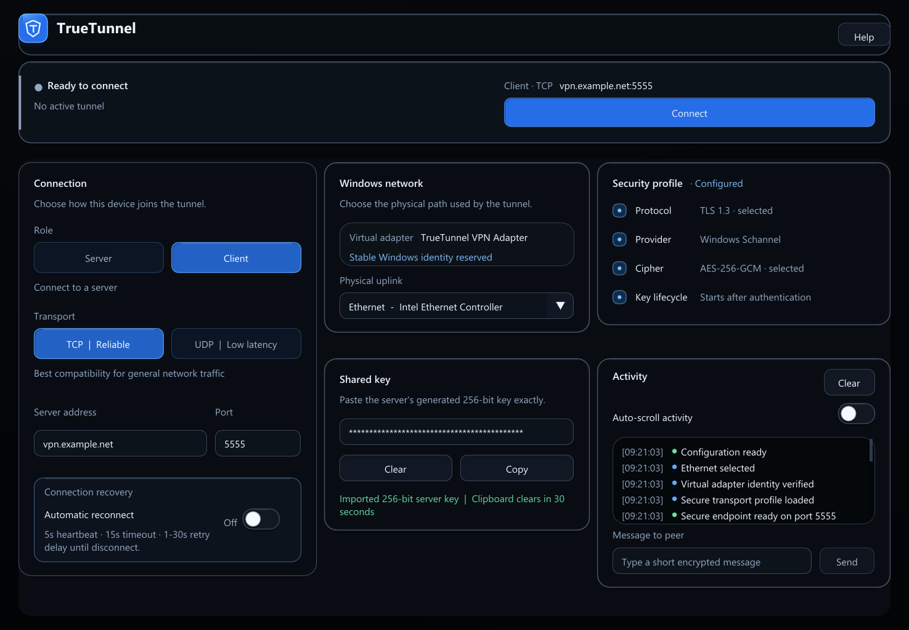
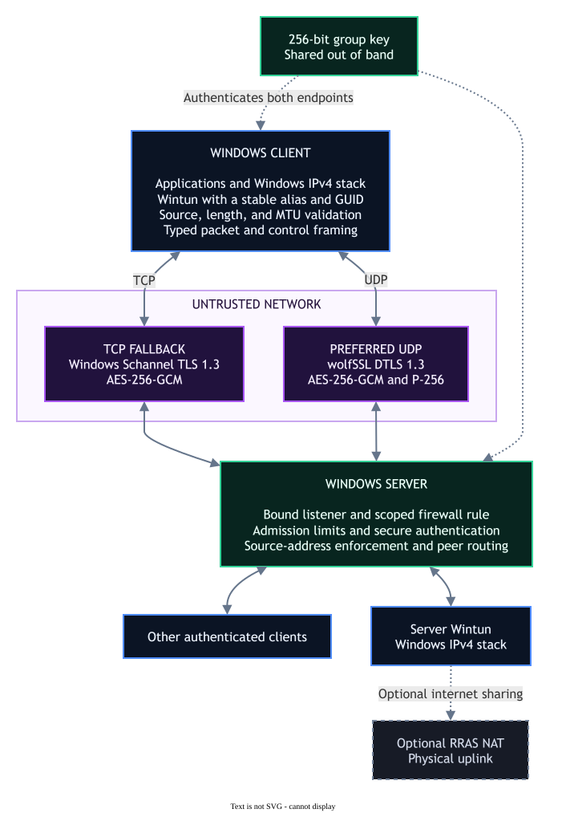

<p align="center">
  
</p>

<h1 align="center">TrueTunnel</h1>

<p align="center">
  <strong>A native Windows IPv4 VPN with a clear, focused control surface.</strong><br>
  DTLS 1.3 over UDP when latency matters. TLS 1.3 over TCP when networks are restrictive.
</p>

TrueTunnel is an open-source IPv4 VPN for Windows. It puts a native dashboard
over Wintun and two standardized encrypted transports:

- **UDP** uses wolfSSL DTLS 1.3 and is the normal choice for interactive traffic.
- **TCP** uses Windows Schannel TLS 1.3 and is the fallback for networks that
  block UDP.

The project is deliberately honest about its scope: it is a focused Windows
VPN, not a replacement for WireGuard or a certified IPsec product. Read
[`docs/SECURITY-DESIGN.md`](docs/SECURITY-DESIGN.md) before using it for a
security-sensitive deployment.

## What you get

- TLS 1.3 and DTLS 1.3, AES-256-GCM, forward-secret handshakes, and bounded
  record processing.
- A stable `TrueTunnel VPN Adapter` identity backed by Wintun.
- One server with multiple authenticated clients, IPv4 routing, and an
  encrypted in-band chat channel.
- Optional client heartbeat and bounded automatic reconnect for both transports.
- TCP make-before-break session renewal and UDP DTLS traffic-key updates.
- A polished ImGui dashboard with activity logs, transport selection, and
  explicit recovery controls.



The current development version is **3.1.0-dev**; it is not a published
release. The latest repository tag is **V3 (3.0.0)**. Windows 11 and Windows
Server 2022 or newer are supported. The VPN process requires Administrator
privileges because it creates a Wintun adapter and changes Windows networking
state.

## Quick start

1. Download or build the `TrueTunnel-<Config>.zip` artifact and extract it to a
   dedicated directory. Keep `TrueTunnel.exe` and the adjacent `wintun.dll`
   together; do not replace the pinned DLL.
2. Start `TrueTunnel.exe` as Administrator. Choose **Server**, select the
   physical uplink, choose TCP or UDP, and select an unused listening port.
3. Generate the 256-bit shared key in the Server dashboard and transfer it to
   the client through a trusted channel. The key is not persisted by TrueTunnel.
4. On the client, choose **Client**, enter the server's address and the exact
   same port, paste the key, select the same transport, and press **Connect**.
5. Prefer UDP. Enable **Automatic recovery** only when short outages should be
   retried; it is optional and off by default.

The key is a group credential: anyone who has it can authenticate. Regenerate
it whenever a member leaves or exposure is suspected. Server startup creates a
temporary Windows Firewall rule scoped to the executable, protocol, local
address, and port; normal shutdown removes that exact rule.

## Choose a transport

| Transport | Use it when | Trade-off |
| --- | --- | --- |
| UDP / DTLS 1.3 | UDP is permitted and latency matters | Lost outer datagrams remain lost; no seamless roaming |
| TCP / TLS 1.3 | UDP is blocked or a TCP-only egress is required | TCP-in-TCP head-of-line blocking can amplify loss and delay |

Both modes use the same Wintun adapter, IPv4 framing, shared-key admission,
limits, and optional recovery. They do not share a live session: changing the
transport requires disconnecting and connecting again.

## Learn the design

The architecture overview shows the runtime data path and its trust boundary.
The SVG contains its draw.io source, so contributors can open and edit it
directly.



The [TLS session-renewal diagram](docs/images/tls-session-renewal.drawio.svg)
shows the authenticated cutover, safe pre-activation rollback, and fail-closed
post-activation path.

The deeper references are organized by job:

- [Architecture](docs/ARCHITECTURE.md) — components, packet flow, lifecycles,
  and Windows integration.
- [Security design](docs/SECURITY-DESIGN.md) — cryptographic profiles,
  authentication, renewal, limits, failure behavior, and limitations.
- [Building](docs/BUILDING.md) — dependencies, reproducible configuration,
  output layout, and packaging.
- [Testing](docs/TESTING.md) — deterministic tests, elevated Wintun E2E, logs,
  latency/throughput checks, and GUI smoke coverage.
- [Troubleshooting](docs/TROUBLESHOOTING.md) — practical recovery and cleanup
  steps for Windows networking issues.
- [Release checklist](docs/RELEASE.md) — versioning, artifact, integrity, and
  licensing checks for maintainers.
- [Security policy](SECURITY.md) — private vulnerability-reporting guidance and
  supported-version expectations.
- [Contributing](CONTRIBUTING.md), [Code of Conduct](CODE_OF_CONDUCT.md), and
  [Changelog](CHANGELOG.md) — project participation and release history.

## Status and boundaries

TrueTunnel is usable for controlled Windows deployments and development, but it
has important boundaries:

- IPv4 only; the tunnel MTU is 1380 bytes.
- One shared group credential; no per-peer identity, revocation, or attribution.
- No kill switch, DNS-leak policy, IPv6 policy, seamless roaming, or signed
  automatic updater.
- Automatic recovery is a bounded short-outage retry, not packet-preserving
  mobility.
- Internet sharing is optional and depends on Windows RRAS NAT. Peer-to-peer
  tunnel traffic can work when RRAS is unavailable, but Internet-bound traffic
  will not be translated.
- The complete application protocol and current wolfSSL configuration have not
  received an independent cryptographic audit and make no FIPS claim.
- The TCP certificate is an ephemeral Schannel server credential; the shared
  key and exporter-bound proof authenticate the peer. It is not hostname/CA
  identity validation.

WireGuard remains the stronger general-purpose default because it has mature
per-peer public-key identity, built-in roaming, IPv6, and a purpose-built small
protocol. IKEv2/IPsec remains the better fit for native OS clients, certificates,
EAP, enterprise policy, and standards interoperability. TrueTunnel's advantage
is its native Windows GUI, Wintun integration, standardized TLS/DTLS choices,
and TCP fallback in one focused product.

## Build and test in one minute

Prerequisites are Visual Studio 2022, a current Windows SDK, CMake 3.20+, Conan
2, network access for the pinned wolfSSL source archive, and the supplied
`deps/wintun.dll`. OpenSSL is neither required nor shipped.

```powershell
conan install . --output-folder=build/conan --build=missing -s build_type=Release
cmake -S . -B build -G "Visual Studio 17 2022" -A x64 `
  -DCMAKE_TOOLCHAIN_FILE=build/conan/build/generators/conan_toolchain.cmake `
  -DCMAKE_PREFIX_PATH=build/conan/build/generators -DBUILD_TESTING=ON
cmake --build build --config Release --parallel
ctest --test-dir build -C Release --output-on-failure
```

The production binary is `build/Release/TrueTunnel.exe`; the integration
harness and focused test executables remain separately named. See
[`docs/TESTING.md`](docs/TESTING.md) for the elevated real-Wintun run:

```powershell
.\build\Release\vpn_integration_test.exe --no-pause
```

The harness writes a flushed `vpn-integration.log` beside itself. Use
`--log-file C:\Logs\truetunnel-e2e.log` for an explicit safe destination.

## Uninstall and cleanup

Disconnect and exit TrueTunnel first. A normal stop removes the adapter,
owned routes, firewall rule, and temporary credentials. If Windows still shows
an exact TrueTunnel adapter after a crash, use the documented, identity-scoped
procedure in [`docs/TROUBLESHOOTING.md`](docs/TROUBLESHOOTING.md). Do not delete
registry keys, routes, or adapters by a broad name prefix, and do not remove the
shared Wintun driver if another product uses it.

To uninstall a manually extracted build, delete the extracted application
directory after disconnecting. The driver package is shared with WireGuard and
must be removed only by the installer or an administrator who has verified that
no Wintun adapter depends on it.

## Licensing

TrueTunnel source is available under MIT or GPLv2, as described in `LICENSE`.
The default build statically links wolfSSL 5.9.2, which is GPLv3 or commercial;
redistribution of the combined binary must follow the applicable wolfSSL terms.
See [`NOTICE`](NOTICE), [`THIRD_PARTY.md`](THIRD_PARTY.md), and the packaged
`licenses/` directory. This summary is not legal advice.
