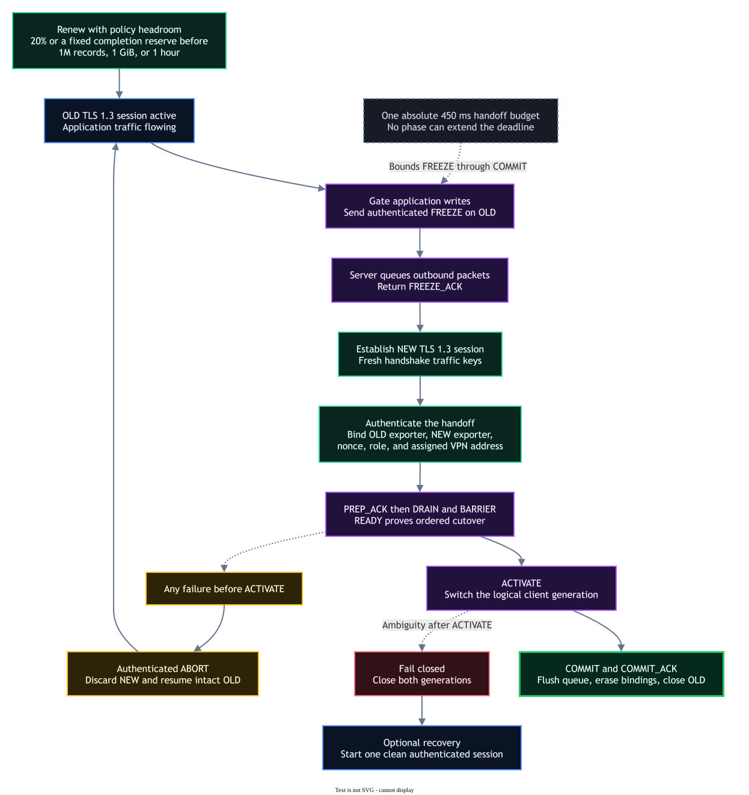

# TrueTunnel architecture

TrueTunnel is a Windows-only, one-server/many-client IPv4 VPN. The GUI and
networking daemon currently run in the same elevated process. Wintun supplies
the virtual interfaces; Windows IP Helper/NetIO configures addresses and
routes; Winsock carries the encrypted transport.

## Runtime components

| Component | Responsibility |
| --- | --- |
| `TrueTunnel.exe` | ImGui dashboard, configuration validation, lifecycle, and tray integration |
| `VpnDaemon` / `VpnController` | Owns start/stop state, telemetry, transport selection, and optional recovery |
| `VpnServer` | Listener, peer admission, address pool, routing, chat fanout, limits, and server-side heartbeat watchdog |
| `VpnClient` | Endpoint resolution, authenticated connection, Wintun egress/ingress, heartbeat, and optional reconnect |
| Secure transport layer | Schannel TLS 1.3 for TCP or wolfSSL DTLS 1.3 for UDP; framing and key lifecycle |
| Wintun / IP Helper | Stable virtual adapter, IPv4 address, routes, MTU, and exact-row cleanup |

## Packet path

Application traffic enters the local Wintun adapter as an IPv4 packet. TrueTunnel
validates the version, header length, total length, source address, and 1380-byte
MTU before wrapping it in a typed `[type][length][payload]` frame. The secure
transport encrypts and authenticates that frame. The server authenticates the
peer, routes it to the assigned client, and applies the same validation before
injecting it into the destination Wintun adapter.

TCP uses one ordered Schannel stream. A lost outer TCP segment can therefore
hold later inner packets (TCP-in-TCP head-of-line blocking). UDP preserves one
inner frame per DTLS application record; a lost outer datagram is not recovered
as application data.

The in-band chat channel uses the same authenticated encrypted transport but is
separately rate-limited and bounded. It is a convenience/control surface, not a
replacement for a management plane.

## Session lifecycle

1. The client resolves an IPv4 literal or hostname with a cancellable, bounded
   Winsock query and protects the selected numeric endpoint from tunnel routing.
2. TCP negotiates the fixed Schannel TLS 1.3 profile. UDP performs the DTLS 1.3
   handshake, including stateless cookie admission and external-PSK binder
   verification before per-peer allocation.
3. Both peers verify the negotiated protocol and cipher properties, then prove
   possession of the shared key with exporter/nonce-bound HMAC authentication.
4. The server allocates an IPv4 address and sends configuration. The client
   creates its deterministic Wintun identity, configures the address and route,
   and begins the bounded packet pumps.
5. Stop, error, or explicit Disconnect cancels reads/writes, drains only safe
   queues, tears down owned network rows, wipes temporary key material, and
   waits for the exact Wintun alias/GUID identity to retire before a new owner
   can be created.

## TCP renewal and UDP rekey

TCP cannot rely on an application-triggered Schannel TLS 1.3 `KeyUpdate`, so it
uses an authenticated make-before-break session replacement. The client freezes
application writes on OLD, authenticates NEW, drains and barriers queued egress,
then commits the cutover. The binding covers both TLS exporters, the assigned IP,
and a fresh nonce. A pre-activation failure aborts and resumes OLD; an
ambiguity after activation closes both generations so split-brain traffic cannot
continue.

UDP requests DTLS 1.3 traffic-key updates before the configured record, byte, or
age limits. A failed update terminates the secure connection rather than
continuing with an over-age key epoch.

## Wintun identity

The GUI uses the compatibility alias `TrueTunnel VPN Adapter`. TrueTunnel
derives a deterministic version-8 GUID from the validated alias and holds a
named interprocess lease across create/configure/close. Before creation it
checks the alias and exact Wintun identity; after creation it verifies the
actual LUID, GUID, and alias before configuring any address or route.

Cleanup is exact-identity only. TrueTunnel does not remove registry rows,
routes, or devices by a display-name prefix and will reject a foreign owner
instead of allowing Wintun to rename that interface with a numeric suffix.

## Failure containment

Handshake, source validation, queue, chat, fanout, and admission limits are
bounded independently. Deadline-aware I/O observes stop requests and avoids
holding a worker indefinitely on a stalled peer. Partial encrypted application
frames or possibly partial writes poison that stream; the implementation does
not attempt to resynchronize on attacker-controlled bytes. Optional recovery
starts a fresh authenticated session with capped equal-jitter backoff and does
not preserve packets sent during an outage.

For cryptographic and trust-boundary details, see
[`SECURITY-DESIGN.md`](SECURITY-DESIGN.md). For build and runtime layout, see
[`BUILDING.md`](BUILDING.md).
